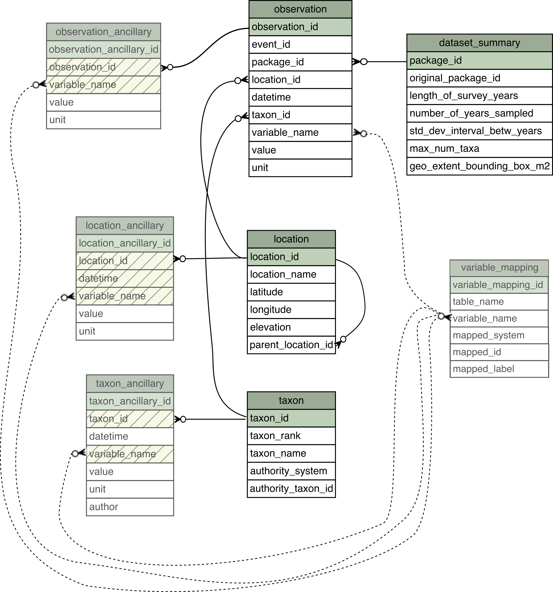

```{r setup, include=FALSE}
knitr::opts_chunk$set(echo = TRUE)
```


## Preparing and loading data

```{r libraries, message=FALSE, warning=FALSE}
library(tidyverse)
library(neonUtilities)

devtools::install_github("sokole/ecocomDP@development")
library(ecocomDP)

```

The ecocomDP retrieves datasets from NEON, EDI, and other repositories. This search function allows you to input a keyword and search for dataset that match your needs. In the example below, the keyword "invertebrates" is used. Uncommenting the second line will allow you to view the table returned from the search function.
```{r search}
search_result <- ecocomDP::search_data(text = "invertebrates")
print(search_result)
# View(search_result)
```

In this example, we are going to use NEON's macroinvertebrate dataset, the 7th and last row in the search result table. To pull this data, we use ecocomDP's read_data function, and input the dataset's id as the first argument. Since this data is from the NEON repository, some optional arguments include a list of sites, start and end dates for the data, and a user-specific API token. More information on using a NEON token can be found here: https://www.neonscience.org/resources/learning-hub/tutorials/neon-api-tokens-tutorial 

```{r token, include=FALSE}
NEON_TOKEN = Sys.getenv('NEON_TOKEN')
```

```{r load data, message=FALSE, warning=FALSE}
inv <- ecocomDP::read_data(
  id = "neon.ecocomdp.20120.001.001",
  site = c('ARIK','CARI','MAYF'),
  startdate = "2017-06",
  enddate = "2020-03",
  token = NEON_TOKEN, #this line should be commented or removed if not using a NEON token
  check.size = FALSE)
```

Now the NEON macroinvertebrate data collected at sites ARIK, CARI, and MAYF from June 2017 to March 2020 is stored in the global environment. We can now begin analyzing and plotting this data using the ecocomDP package.

## Data model

First, it's important to understand how ecocomDP data model works. There are a total of eight tables. The main three tables are titled observation, location, and taxon. The remaining five tables provide additional information about the dataset, but are not used in the following plotting functions. The image below depicts each table and some of the variables they contain.

{width=75%}

\newpage

## Plotting functions
To begin, you may be interested in viewing where the sites are located. The plot_sites function shows each sites' location over a map of the US, based on their coordinates stored in the location table. This function is unique in that its first argument is a flattened data table. To get this flattened table, we use ecocomDP's flatten_data function.

```{r map sites, message=FALSE, warning=FALSE, fig.cap="Map of US with location of each site in the dataset."}
inv_flat <- ecocomDP::flatten_data(inv[[1]]$tables)
ecocomDP::plot_sites(flat_data = inv_flat)
```

A quick internet search can confirm that each of the NEON sites are plotted in the correct location. ARIK refers to the Arikaree River that runs primarily through the state of Colorado, CARI refers to the Caribou Creek in central Alaska, and MAYF refers to the Mayfield Creek in west-central Alabama.

\newpage
Since we are analyzing macroinvertebrate data, we may be interested in viewing which taxa ranks are most commonly recorded. To view this information, we use the plot_taxa_rank function. This function takes both the observation table and the taxon table as its first two arguments and produces a bar graph displaying the frequencies of each taxon rank.

```{r taxa rank, fig.cap="Over all three sites, the taxon rank genus is most commonly recorded."}
ecocomDP::plot_taxa_rank(inv[[1]]$tables$observation,
                         inv[[1]]$tables$taxon,
                         inv[[1]]$tables$observation$location_id)
```

\newpage
Similarly, plot_taxa_rank_by_site plots the frequencies of each rank, but divides the graph into each site. In this example, there are three sites, whose names appear at the top of each bar graph. 

```{r taxon rank by site, message=FALSE, fig.cap="The taxon rank genus is most commonly recorded at all three sites individually."}
ecocomDP::plot_taxa_rank_by_site(inv[[1]]$tables,
                                 inv[[1]]$tables$observation$location_id)
```

\newpage
The plot_stacked_taxa_by_site function plots the frequencies of each taxa gathered from both sites. Each of the sites are color coded; in this example, red represents ARIK and green represents CARI, and blue represents MAYF. The argument rank="order" is added so the taxon orders are plotted. It is important to note this does not include more specific ranks (ex: does not include the order when the observation's taxon_rank=species, despite that species belonging to the same order).

```{r stacked taxa by rank (order) by site, message=FALSE, fig.cap="Collembola sp. is the most commonly recorded order at over all three sites."}
ecocomDP::plot_stacked_taxa_by_site(inv[[1]]$tables,
                                    inv[[1]]$tables$observation$location_id,
                                    rank="order")
```

<!-- Future work: ordering the bars from largest to smallest, including the taxon hierarchy so that all subsequent taxa are plotted when rank > species. -->

\newpage
When the rank is not specified, all taxa observed are plotted. Since some datasets may have a large number of taxa, users may specify a cutoff such that only taxa whose counts are greater than the cutoff are shown. This example sets the cutoff equal to 30, so any taxa with occurrences less than 30 are excluded. Again, this plot does not account for more specific ranks. This can be corrected in the future by implementing a taxon hierarchy that matches any specific rank to its higher ranks.

```{r stacked taxa by rank by site, message=FALSE, fig.cap="Most commonly recorded taxa at each site. Many of these taxa with high occurences are only present at one of the three sites."}
ecocomDP::plot_stacked_taxa_by_site(inv[[1]]$tables,
                                    inv[[1]]$tables$observation$location_id,
                                    cutoff=30)

```

\newpage
To show the averages of each taxa, we use the plot_faceted_densities function. This plot is split by sites and only includes the taxa from a specified rank; in this example, we are observing the averages of each order. Similar to the plots above, this does not include more specific ranks.
``` {r faceted densities plot, message=FALSE, fig.cap="Averages of each order at individual sites."}
ecocomDP::plot_faceted_densities(inv[[1]]$tables,
                                 inv[[1]]$tables$observation$location_id,
                                 rank="order")
```


<!-- If we wanted to plot sites from multiple datasets, we could use the flatten_data() function on both objects, then combine the two tables using the bind_rows() function. Note the dataset labeled ants_L1 is built-in to the ecocomDP package and is loaded at the same time as the library. Since ants_L1 is experimental data over 8 plots at the same EDI site, each treatment is plotted and labeled in the same spot. -->
<!-- ```{r plot sites both, message=FALSE, warning=FALSE, fig.cap="Sites from both the macroinvertebrate dataset and the ants data set are shown on the US map."} -->
<!-- inv_flat <- ecocomDP::flatten_data(inv[[1]]$tables) -->
<!-- ants_flat <- flatten_data(ants_L1[[1]]$tables) -->
<!-- inv_and_ants <- bind_rows(inv_flat, ants_flat) -->
<!-- ecocomDP::plot_sites(inv_and_ants, -->
<!--                      inv[[1]]$tables$observation$location_id) -->
<!-- ``` -->

\newpage
## Existing plotting functions in the ecocomDP package

The function plot_taxa_diversity records the number of unique taxa observed at each site over time.
```{r alpha diversity, message=FALSE, warning=FALSE, fig.cap="Number of taxa across all three sites over time."}
ecocomDP::plot_taxa_diversity(inv[[1]]$tables$observation,
                              inv[[1]]$tables$observation$taxon_id)
```

\newpage
To visualize when samples were taken, the plot_taxa_sample_time function is used. This function allows you to compare sampling times across all three sites, as each month is represented by a vertical line.
<!-- The size of each point represents the number of observations recorded at each sampling time. -->
```{r samples over time, message=FALSE, warning=FALSE, fig.cap="The months that each of the sites were sampled is recorded by a black point."}
ecocomDP::plot_taxa_sample_time(inv[[1]]$tables$observation,
                                inv[[1]]$tables$observation$taxon_id)
```

<!-- One way to potentially improve this plot is by making each dot size bigger when more observations are present at a particular site and time. -->

\newpage
To observe how the number of taxa changes as new sites are added, the function plot_taxa_accum_sites is used. The x-axis should show the total number of sites, which is three in this example. The y-axis displays the number of unique taxa. As more sites are added, the line will start to curve and level-off, as less and less unique taxa are identified.
```{r taxa over sites, message=FALSE, warning=FALSE, fig.cap="As the number of sites increases, the cumulative number of taxa also increases. A large number of sites would result in a curve that levels-off."}
ecocomDP::plot_taxa_accum_sites(inv[[1]]$tables$observation,
                                inv[[1]]$tables$observation$location_id)
```

\newpage
Changes in the cumulative number of taxa can also be observed over time. Using the plot_taxa_accum_time function, you can observe how many new, unique taxa are observed at each sampling time. Each site is represented by a different color, and the black line shows the summation of all sites' taxa counts. 
```{r taxa over time, message=FALSE, warning=FALSE, fig.cap="As time increases, the cumulative number of taxa also increases, but at a much slower rate. As more unique taxa are observed, the number of unidentified remaining taxa decreases, so there are less new ones to discover."}
ecocomDP::plot_taxa_accum_time(inv[[1]]$tables$observation,
                               inv[[1]]$tables$observation$location_id)
```

\newpage
To see how many taxa sites have in common with each other, plot_taxa_shared_sites can be used. This function produces a matrix-like plot representing the shared taxa between all sites. Sites with higher number of shared taxa are colored red, and sites with lower number of shared taxa will be blue. The numbers along the diagonal represent the total number of taxa at each individual site.
```{r taxa shared sites, message=FALSE, warning=FALSE, fig.cap="The sites ARIK and MAYF have the most taxa in common with each other."}
ecocomDP::plot_taxa_shared_sites(inv[[1]]$tables$observation,
                                 inv[[1]]$tables$observation$location_id)
```
