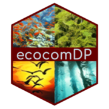

<!-- README.md is generated from README.Rmd. Please edit that file -->

# ecocomDP <a href="https://ediorg.github.io/ecocomDP/"></a>

<!-- badges: start -->

[](https://cran.r-project.org/package=ecocomDP)
<!-- badges: end -->

## Overview

Tools to create, use, and convert ‘ecocomDP’ datasets. ‘ecocomDP’ is a
dataset design pattern for harmonizing ecological community surveys in a
research question agnostic format, from source datasets published across
multiple repositories, and with methods that keep the derived datasets
up-to-date as the underlying sources change. Described in O’Brien et
al. (2021), <https://doi.org/10.1016/j.ecoinf.2021.101374>.

## Installation

Get the latest CRAN release:

``` r
install.packages("ecocomDP")
```

Get the latest development version:

``` r
# install.packages("remotes")
remotes::install_github("EDIorg/ecocomDP", ref = "development")
```

## Usage

- [Create ecocomDP
  Data](https://ediorg.github.io/ecocomDP/articles/create.html)
- [Use ecocomDP
  Data](https://ediorg.github.io/ecocomDP/articles/use.html)
- [Convert ecocomDP Data to Another Model
  Format](https://ediorg.github.io/ecocomDP/articles/convert.html)

## Model documentation

- [Model
  Overview](https://ediorg.github.io/ecocomDP/articles/model_overview.html)
- [Shared Practices for Creating ecocomDP
  Data](https://ediorg.github.io/ecocomDP/articles/shared_practices_create.html)

## Getting help

Use [GitHub Issues](https://github.com/EDIorg/ecocomDP/issues) for bug
reporting, feature requests, and general questions/discussions. When
filing bug reports, please include a minimal reproducible example.

## Contributing

Community contributions are welcome! Please reference our [contributing
guidelines](https://github.com/EDIorg/ecocomDP/blob/master/CONTRIBUTING.md)
for details.

------------------------------------------------------------------------

Please note that this project is released with a [Contributor Code of
Conduct](https://github.com/EDIorg/ecocomDP/blob/master/CODE_OF_CONDUCT.md).
By participating in this project you agree to abide by its terms.
