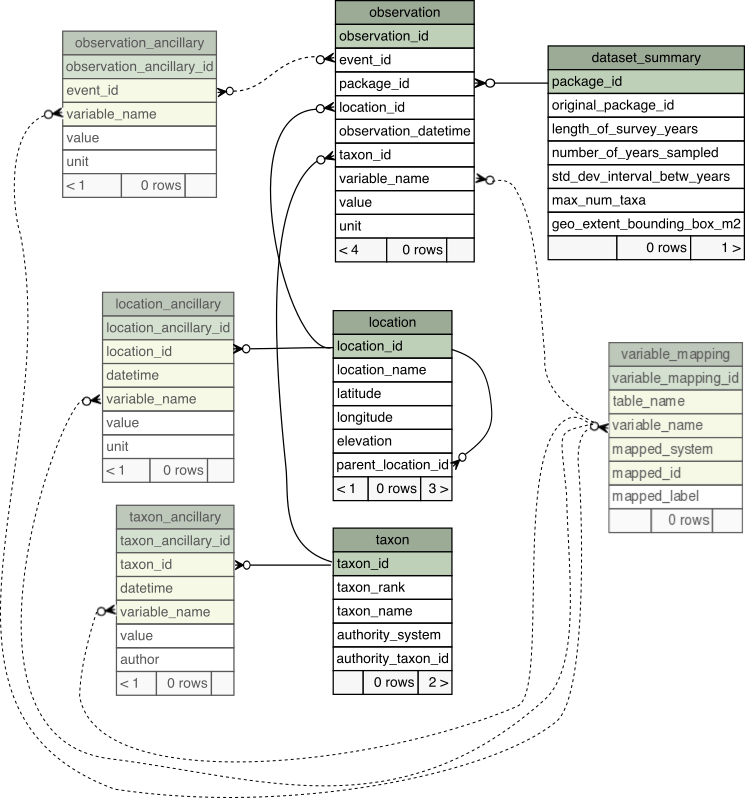

# Visualization of table contents and relationships

Figure 1: The optional tables are partly transparent. The primary key for each table is the id (column named "table_name_id", with a green background. Columns that (as a group) should be unique within the table, have a yellow background. Many:many relationships are shown with dotted lines (side note: if this model were implemented in a relational database, each many:many relationship would require an intermediate table).
