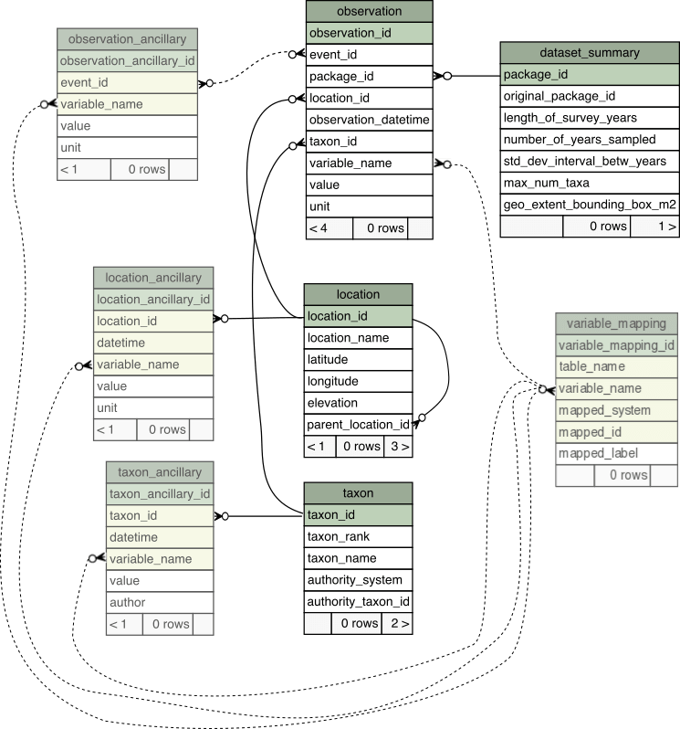

```{r, include = FALSE}
knitr::opts_chunk$set(
  collapse = TRUE,
  comment = "#>"
)
```
---

#### Contents

*   [Table descriptions, relationships, and requirements](#main)
    *   [Tables](#tables)
        *   [observation](#observation)
        *   [location](#location)
        *   [taxon](#taxon)
        *   [dataset_summary](#dataset_summary)
        *   [observation_ancillary](#observation_ancillary)
        *   [location_ancillary](#location_ancillary)
        *   [taxon_ancillary](#taxon_ancillary)
        *   [variable_mapping](#variable_mapping)
*   [Entity Relationship Diagram](#vis)

---

# Table descriptions, relationships, and requirements {#main}

## Overview

This document describes the eight ecocomDP tables and their contents. Four tables are required (observation, location, taxon, and dataset_summary). Each main table (observation, location, taxon) has an optional ancillary table for additional information. These are included because primary research typically contains related measurements which may be of interest during analysis. The dataset_summary table is populated from the observation table contents, and the variable_mapping table holds URIs and labels for external measurement dictionaries.

An example ecocomDP dataset is [here](https://portal.edirepository.org/nis/mapbrowse?scope=edi&identifier=193) and a graphic showing all tables and their relationships is available [here](#vis). 

## Tables {#tables}

| table name 	|   required?	|   references tables    | unique constraints |
|--------------|-------------|------------------------|------------------------|
| observation |yes| location, taxon, dataset_summary | observation_id | 
| location | yes | NA |  location_id | 
| taxon | yes | NA | taxon_id |
| dataset_summary| yes | NA | package_id |
| observation_ancillary  | no | observation | observation_id, variable_name  |
| location_ancillary | no | location | location_id, datetime, variable_name |
| taxon_ancillary | no | taxon | taxon_id, variable_name |
| variable_mapping | no | observation, observation_ancillary, location_ancillary, taxon_ancillary | table_name, variable_name |

### Table: observation {#observation}

Description: This is the core table, which holds the observations being analyzed (e.g. organism abundance or density). Observations must be linked to a taxon and to a location. Linking to ancillary observations is optional.

#### Columns

|  column name 	|   type	|   not NULL required?	|  references 	| description | example |
|---------------|---------|-----------------------|-------------------|--------------|---------|  
| observation_id | character | yes | NA | Identifier assigned to each unique observation. | 4161 |
| event_id | character | yes | NA | Identifier assigned to each unique sampling event. | 2009mar03_dive1 |
| package_id | character | yes | /dataset_summary/package_id | Identifier of this data package. | edi.100001.1 |
| location_id | character | yes | /location/location_id | A reference to a location.	|  sbc_ABUR_1 |
| datetime | datetime | yes | NA | Date and time of the observation in ISO-8601 format. | 2017-08-01, 2017-08-01 14:30:00 |
| taxon_id | character | yes | /taxon/taxon_id | A reference to a taxon. | sbclter_MAPY |
| variable_name | character |yes| NA | Name of the measured variable.	| count	|
| value | float | yes | NA | Value of the measured variable.	| 7	|
| unit | character | yes | NA | Unit of the measured variable. | number	|


### Table: location {#location}

Description: Identifying information about a place (longitude, latitude, elevation). The table is self-referencing so that sites can be nested.

#### Columns

|  column name 	|   type	|   not NULL required?	|  references	| description | example |
|---------------|---------|-----------------------|-------------------|-------------|---------|
| location_id | character | yes  	      |   NA| Identifier assigned to each unique location. | sbclter_abur_I |
| location_name   	|  character  	| no 	|   NA | Sampling location full name.	|  Arroyo Burro Reef, transect I 	|
| latitude 	  |  float 	|   	no                  |   NA |Latitude in decimal degrees. Latitudes south of the equator are negative.|  34.400275	|
| longitude 	|  float 	|   	no                  |   NA |Longitude in decimal degrees. Longitudes west of the prime meridian are negative.| -119.7445915 |
| elevation	  |  float 	|   	no                  |   NA |Sampling location elevation in meters relative to sea level. Above sea level is positive. Below sea level is negative.| -15	|
| parent_location_id	|  character | no  	|   NA| Sampling location identifier from this table for the parent of this sampling location. Presence indicates nested locations.	|  sbclter_abur_I	|


### Table: taxon {#taxon}

Description: Identifying information about a taxon (e.g. name, id, and system).

#### Columns

|  column name 	|   type	| not NULL required? |  references 	| description | example |
|---------------|---------|--------------------|-------------------|--------------|---------|
| taxon_id           | character |  yes        | NA | Identifier assigned to each unique organism. | sbclter_MAPY |  
|	taxon_rank         | character |  no         | NA | Taxonomic rank of the organism. | species |   
|	taxon_name         | character |  yes        | NA | Taxonomic name of the organism. | Macrocystis pyrifera | 
|	authority_system   | character |  no         | NA | Name of the system assigning the authority_taxon_id. | ITIS|  
|	authority_taxon_id | character |  no         | NA | Identifier in the authority system corresponding to the taxon_name. |  11274|


### Table: dataset_summary {#dataset_summary}

Description: Summary info about the dataset.

#### Columns

|  column name 	|   type	|   not NULL required?	|  references 	| description | example |
|---------------|---------|-----------------------|-------------------|--------------|---------|
| package_id                  | character |yes| NA 	| Identifier of this data package.	|  edi.100001.1 	|
| original_package_id         | character |no| NA	|  Identifier of source data package. | knb-lter-sbc.21.17 |
| length_of_survey_years      | integer   |yes| NA	| Number of years the study has been ongoing.	| 17  	| 
| number_of_years_sampled     | integer   |yes| NA | Number of years within the period of the study that samples were taken.	| 17  	|
| std_dev_interval_betw_years | float     |yes| NA | Standard deviation of the interval between sampling events. | 1.1  	|
| max_num_taxa                |integer    |yes| NA |  Number of unique values in the taxon table. | 10  	|
| geo_extent_bounding_box_m2  |float      |no| NA	| Area of the study location.	|  40 	|


### Table: observation_ancillary {#observation_ancillary}

Description: Ancillary information about an observational event for context. These are very often environmental driver data in analyses (e.g. water depth, height of a tower, temperature of medium).

#### Columns

|  column name 	|   type	 |   not NULL required?	|  references	| description | example |
|---------------|----------|-----------------------|-------------------|--------------|---------| 
| observation_ancillary_id | character |yes| NA	| Identifier of the observation ancillary information.	| 	TBE01JUN05  	|
| observation_id             | character |yes| /observation/observation_id  | A reference to an observation. References the observation_id field of the observation table. | 4161      |
| variable_name            | character |yes| NA | Name of the measured variable. 	|  sample_z  	|
| value                    | character | no| NA	| Value of the measured variable.	|  5  	|
| unit                     | character | no| NA	| Unit of the measured variable. |  meter 	|


### Table: location_ancillary {#location_ancillary}

Description: Additional information about a place that does not change frequently (e.g. lake area or depth, experimental treatment). Features that change frequently are more closely related to the observational event, and are thus kept in the observation_ancillary table. Ancillary observations are linked through the location_id, and one location_id may have many ancillary observations about it.

#### Columns

|  column name 	|   type	|   not NULL required?	|  references	| description | example |
|---------------|---------|-----------------------|-------------------|-------------|---------| 
|location_ancillary_id | character |yes| NA | Identifier of the location ancillary information.	|   	|
|location_id           | character |yes| /location/location_id   	| A reference to a location. References the location_id field of the location table.	| sbclter_ABUR_1  	|
|datetime              | datetime  |no | NA | Date and time of the ancillary information in ISO-8601 format. | 2017-08-01, 2017-08-01 14:30:00 |
|variable_name         | character |yes| NA | Name of the measured variable. | treatment  	|
|value                 | character |yes| NA | Value of the measured variable.	| kelp removal  	|
|unit                  | character |no | NA | Unit of the measured variable.	|   	|


### Table: taxon_ancillary {#taxon_ancillary}

Description: Additional info about an organism that does not change frequently (e.g. trophic level). Features that change frequently are probably observations. Ancillary observations are linked through the taxon_id, which may have many ancillary observations about it.

#### Columns

|  column name 	|   type	|   not NULL required?	|  references | description | example |
|---------------|---------|-----------------------|-------------------|--------------|---------|     
| taxon_ancillary_id | character |yes| NA | Identifier of the taxon ancillary information. 	|   	|
| taxon_id           | character |yes| /taxon/taxon_id |  A reference to a taxon. References the taxon_id field of the taxon table.	|   	|
| datetime           | datetime |no| NA | Date and time of the ancillary information in ISO-8601 format. | 2017-08-01, 2017-08-01 14:30:00 |
| variable_name      | character |yes| NA | Name of the measured variable.	|  trophic_level 	|
| value              | character |yes| NA | Value of the measured variable.	|   primary producer	|
| unit               | character |no | NA | Unit of the measured variable.	|   	|
| author             | character | no | NA | Author associated with identification of the taxon. |    |


### Table: variable_mapping {#variable_mapping}

Description: Information linking a variable_name used in a table to an external definition.

This optional table holds mappings (or relations) between variable names in the data tables and measurement definitions external to the data package. This table has multiple uses: 

- provides definitions for variables in the datasets (more extensive than might be found in metadata) 
- code can use this table to  to create EML code-definition pairs or annotations in metadata
- a single column in a data table may have mappings to multiple dictionaries, by including multiple rows for it

#### Columns

|  column name 	|   type	 |   not NULL required?	|  references	| description | example |
|---------------|----------|-----------------------|-------------------|--------------|---------| 
| variable_mapping_id  | character |yes| NA	| Identifier of the variable mapping information.	| 	1  	|
| table_name           | character |yes| NA	| Name of the table containing this variable. 	| 	my_observation  	|
| variable_name        | character |yes| /table/variable_name | Name of the measured variable in another table. 	|  sample_z  	|
| mapped_system        | character | no| NA	| System defining variable_name.	|  NERC  	|
| mapped_id     | character | no| NA	| Identifier of the definition in mapped_system.	| SDN:P07::CFSN0721 	|
| mapped_label  | character | no| NA	| Label for variable_name in mapped_system.	|  depth  	|
---
# Entity Relationship Diagram {#vis}

```{r echo=FALSE, out.width='100%'}

```
Figure 1: The optional tables are partly transparent. The primary key for each table is the id (column named "table_name_id", with a green background. Columns that (as a group) should be unique within the table, have a yellow background. Many:many relationships are shown with dotted lines (side note: if this model were implemented in a relational database, each many:many relationship would require an intermediate table).


