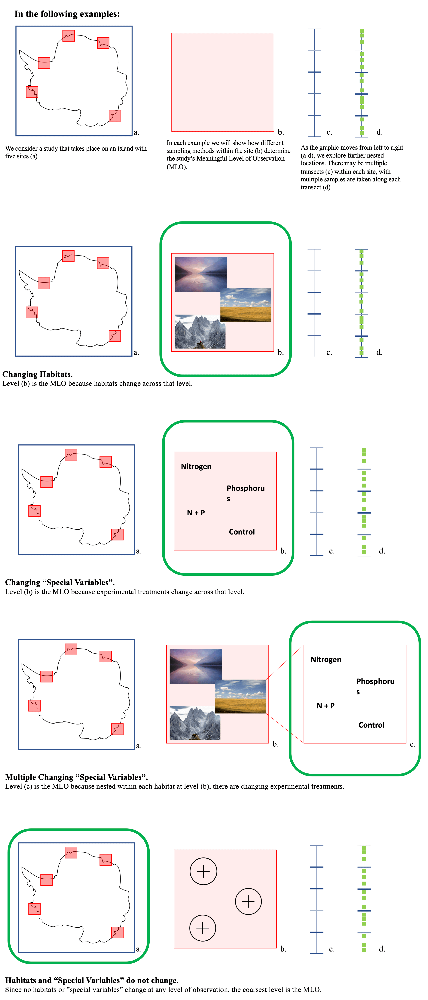

```{r, include = FALSE}
knitr::opts_chunk$set(
  collapse = TRUE,
  comment = "#>"
)
```

---

This document assumes you understand the ecocomDP model. To learn about the model and its scope, refer to the [Model Overview Vignette](https://ediorg.github.io/ecocomDP/articles/model_overview.html) and the [Ecological Informatics Article](https://doi.org/10.1016/j.ecoinf.2021.101374).

---

# Introduction
This document delineates the practices that all creators of ecocomDP formatted datasets should adopt in order for the community to build a cohesive and interoperable collection. It contains detailed descriptions of practices, definitions of concepts, and solutions to many common issues.

Early sections address important considerations for anyone thinking about converting source datasets to the ecocomDP model, then focus shifts to an examination of the model components in greater detail. These shared practices are written with the intention to help simplify the conversion process.

If you are new to the conversion process, we recommend reading the [Getting Started](#getting_started) and [Concepts](#concepts) sections, reviewing the [Create](https://ediorg.github.io/ecocomDP/articles/create.html) and [Model Overview](https://ediorg.github.io/ecocomDP/articles/model_overview.html) vignettes, and referring back to this document as questions arise. A thorough understanding of the ecocomDP model and some foundational concepts will greatly simplify the conversion process.

Each ecocomDP dataset (Level-1; L1) is created from a raw source dataset (Level-0; L0) by a unique conversion script. Inputs are typically from the APIs of data repositories and monitoring networks, and outputs are a set of archivable files. The derived ecocomDP dataset is delivered to users in a consistent format by [`read_data()`](https://ediorg.github.io/ecocomDP/reference/read_data.html) and the conversion script provides a fully reproducible and automated routine for updating the derived dataset whenever a new version of the source data are released.
```{r echo=FALSE, out.width='100%', fig.cap='Figure 1. The Level 0 (L0) dataset is the incoming original data with complete metadata. Level 1 (L1) dataset is the L0 dataset reformatted according to the predefined ecocomDP model. Researchers are able to use L1 datasets as inputs to speed their analyses and generate Level 2 (L2) data. (Adapted from [O’Brien et al. 2021](https://doi.org/10.1016/j.ecoinf.2021.101374)).'}
knitr::include_graphics('./workflow.png')
```

# Getting Started {#getting_started}
## Identifying a candidate L0 dataset
Not all source datasets are good candidates for ecocomDP. Features of a good candidate include datasets that:

*   Are about community surveys not population surveys. An [ecological community](http://purl.obolibrary.org/obo/PCO_0000002) is a multi-species (at least two) collection of organisms living in a particular area, whereas a [population](http://purl.obolibrary.org/obo/PCO_0000001) is a collection of organisms, all of the same species, that live in the same place.
*   Form long-term observation with a suggested minimum of 5 years, which can be ignored for datasets with exceptionally wide spatial extents.
*   Have ongoing data collection and will eventually form long-term observation.
*   Are accompanied by information rich metadata written in the [Ecological Metadata Language (EML)](https://eml.ecoinformatics.org/).
*   Have data and metadata that are programmatically accessible from a trustworthy, stable, and persistent host (i.e. repository or other web-accessible data provider).

## Understanding the L0 dataset
A thorough understanding of the L0 dataset is required before actually performing any transformations. To gain understanding of an L0 dataset we recommend:

*   Reading the abstract, methods, and keywords to gain insights into the scope, structure, and temporal and spatial scales of the study.
*   Reviewing the data object descriptions to understand how data are related across tables.
*   Importing the dataset into R and exploring any of your data specific questions.

Major issues at this point may suggest the amount of work required to convert the L0 dataset to the ecocomDP model is not worth it.

## Resolving issues
After gaining a sufficient understanding of the L0 dataset, you are ready to assess, and hopefully resolve, any issues that are obvious from the start. To help draw out some of these apparent issues, you may want to create a high-level plan for combining the L0 tables (i.e. Row-wise bindings or joined with shared keys?) and mapping their columns to the L1 ecocomDP model. Here are some solutions (ordered by priority) for resolving issues at this stage in the creation process:

1. Work with the L0 author/manager to fix the issues - Fixing the issue here both communicates best practices for future data curation and immediately improves data quality.

    *   If the L0 dataset contains a column entirely of NAs, the conversion script should be written so that the L0 variable will populate the correct L1 table if it is ever filled in a future revision.
    *   When the structure of the L0 dataset (column names, codes used for species, etc.) prevents optimal L1 dataset creation, proceed with writing the conversion script and then provide feedback to the L0 author/manager. Ensure that your conversion script will have the functionality to handle revisions to the L0 dataset.
    *   Make use of the `message()` function to alert ecocomDP script maintainers to sections of code that could improve in future L0 dataset updates.
    
1. Modify L0 components - Modifying L0 components is only permitted in rare cases. This list highlights the L0 components and specific scenarios in which you should modify them:

    *   Duplicate column names - Only change the L0 column names if they create conflicts during joins (i.e. two L0 tables having the same column names) or share the name with an L1 table's column name. In either case, always preserve the original column name. Append a  prefix or suffix to the original column name so that it is distinct but still recognizable enough to be used as a reference to the L0 metadata.
    *   Non-point locations - Currently, only point coordinates are accepted by the ecocomDP model; use the centroid of bounding areas if presented with non-point locations.
    *   Datetime formats - Conversion of datetimes to the ecocomDP standard is required (e.g. YYYY-MM-DD hh:mm:ss or a subset thereof). Always combine Year, Month, Day, and time columns to the temporal level of observation (e.g. [edi.334.2](https://portal.edirepository.org/nis/metadataviewer?packageid=edi.334.2)).
    *   Missing value codes - Missing value codes that are explicitly declared in the L0 metadata should be converted to NA. When not declared but unambiguously interpretable as a missing value (e.g. “” in a comments field) then convert to NA. If it is ambiguous, don’t modify the L0 data.
    *   Different temporal resolution among the L0 tables creates a joining/stacking issue. To solve it, assign the coarsest temporal resolution to the datetime field of all the L0 tables, then store the more precise datetime variables in the observation_ancillary table (e.g. [edi.291.2](https://portal.edirepository.org/nis/metadataviewer?packageid=edi.291.2)). 

1. Omit L0 data - ecocomDP is a flexible model but can’t handle everything. Convert as much as possible and drop the remainder. If content is dropped, then describe what and why using comments in the conversion script. Some guidelines for when you should drop content:

    *   If it is necessary to drop observations (rows), see the section [Omitting rows](#omitting_rows).
    *   If it can be derived from the preserved content (e.g. year can be derived from date, a taxa’s common name can be derived from its species name) then you can drop it from the L1 dataset if it does not fit the model (i.e. L1 data tables don’t pass validation).
    *   If it is ancillary information to data in one of the L1 ancillary tables that does not have a simple one-to-one, row-wise relationship, then it is too far removed from the core content of the L1 dataset. (e.g. A temperature sensor collects environmental data that supports the core observations. This temperature data belongs in the observation_ancillary table. If maintenance information for the temperature sensor is included, it could be omitted from the L1 dataset because it cannot be linked to the temperature observations within the model.) However, if the data is so important that it shouldn’t be dropped, then append a suffix to the supporting data’s original variable name that references the ancillary data (e.g. ancillary data “Site” has supporting data “lat” and “lon”. The variables “Site”, “lat_Site” and “lon_Site” all belong in ancillary data).
    *   Large surveys, sampling campaigns, and experiments will occasionally include information that is not central to the community ecology aspect of the L0 dataset (e.g. [edi.115.2](https://portal.edirepository.org/nis/mapbrowse?scope=edi&identifier=115&revision=2), [edi.247.3](https://portal.edirepository.org/nis/mapbrowse?scope=edi&identifier=247&revision=3)). See the section [Omitting tables](#omitting_tables) to determine if or how you should omit entire data tables from the L1 dataset.
    
If the above options don’t solve the issue, then don’t convert it. There are many more datasets out there in the world to convert!

### Omitting rows {#omitting_rows}
When an L0 dataset is really valuable, but issues with the dataset (e.g. changes in temporal or spatial resolution across observations; [edi.251.2](https://portal.edirepository.org/nis/mapbrowse?scope=edi&identifier=251&revision=2)) prevent conversion, the best option may be to convert a subset of the observations to the ecocomDP format. Follow these steps for omitting rows from the L0 dataset:

*   Append `message(paste0("This L1 dataset is derived from a version of ", source_id, "with omitted rows."))` below the `create_eml()` function call in the `create_ecocomDP()` function definition.
*   After omitting rows, there may be residual columns that only applied to the now-omitted rows. You can remove these columns, but do not remove columns outside of this context.

### Omitting tables {#omitting_tables}
You may decide that only a subset of the data tables within an L0 dataset are well-suited to the ecocomDP format. In this case you have the option to omit entire data tables and only convert those that will fit the model.

When determining which tables to convert and which to omit, first identify which table(s) contain the “core” observation information. This will be the backbone of the intermediate "flat" table. Once the flat table is instantiated around the core observation, determine the shared keys by which to join the other L0 tables. The following types of variables are examples of common keys shared between data tables:

*   Time (a column for year, month, day, date, or combination).
*   Location (a column for site, plot, transect, or combination). 
*   Taxonomic information ( a species, scientific name, common name, or similar column).
*   Other shared variables.

If you encounter tables that can’t be joined to the core observation information, possibly because they focus on a different time/location/taxon entirely, omit these problematic tables. Apply the following changes to the conversion script to highlight the table omission:

*   In the “Join and flatten source data” section of the create_ecocomDP function definition, write a brief comment that highlights and justifies the decision to trim the L0 tables (i.e. `# atmospheric_gas_concentrations table did not share a key with the bird_count table and was omitted`).
*   Append `message(paste0("This L1 dataset is derived from a trimmed version of ", source_id, "with omitted tables"))` below the `create_eml()` function call in the `create_ecocomDP()` function definition.

# Creating the Conversion Script
Write a conversion script to create an ecocomDP dataset from a standard set of minimal inputs (i.e. arguments to the `create_ecocomDP()` function). The conversion script should have some tolerance (i.e. error handling) for re-running the script at a later time on a changed source dataset. The script should utilize functionality that will either handle a revised source dataset or alert the ecocomDP script maintainers and provide them with enough information to quickly diagnose and fix any problems.

Currently, only the EDI Data Repository is recognized by the ecocomDP project. If you would like support extended to your data repository, then please place a request in the [ecocomDP project issue tracker](https://github.com/EDIorg/ecocomDP/issues) and we will add the supporting code to index and read ecocomDP datasets from your repository. 

To convert an L0 dataset, implement the following processes in your conversion script:

*   Join source data and relevant content into a single “flat” table.
*   Use `create_*()` functions to parse out the relevant derived L1 tables.
*   Write tables to file with `write_tables()`
*   Validate L1 tables with `validate_data()`
*   Create EML metadata with `create_eml()`

For details on the processes within the conversion script, see the [Create vignette](https://ediorg.github.io/ecocomDP/articles/create.html).

## Basics
### Do's

*   R is the only supported language.
*   Every ecocomDP dataset must be fully created from the R script named “create_ecocomDP.R”; this is the conversion script.
*   The only code in the conversion script should be the `library()` calls, the main function definition, and supporting function definitions outside of the `create_ecocomDP()` function.
*   Explicitly state the dependencies of the function as `library()` calls for each (e.g. `library(dplyr)`)
*   Use the function name “create_ecocomDP” (i.e. `create_ecocomDP <- function(...) {...}` and only use the allowed set of arguments:
    *   `path` - Where the ecocomDP tables will be written
    *   `source_id` - Identifier of the source dataset
    *   `derived_id` - Identifier of the derived dataset
    *   `url` - The URL by which the derived tables and metadata can be accessed by a data repository. This argument is used when automating the repository publication step, but not used when manually publishing.
*   Use a regex to refer to tables with names that are likely to change with future revisions.
*   Convert missing value codes to NA. This is the ecocomDP standard.
*   Whenever possible, programmatically insert information from the L0 metadata rather than manually copying and pasting. This facilitates the low effort transfer from a revised source dataset to the derived dataset, enabling automated maintenance.
*   Comment your code liberally describing “what” and “why” so that future maintainers don't have to spend as much time learning the nuances of the data.
*   Use messaging (i.e. `message()`) and section headers (ctrl-shift-R in RStudio) at the beginning of each major code block to help maintainers with debugging, should it be needed.

### Don’ts

*   The rule of thumb is to never change the L0 dataset; only restructure/reformat:
    *   See [Value-Added Features](#value_added_features) for acceptable information to add.
    *   Do not average or modify values. Users (e.g., synthesis working groups) will perform these calculations for their own needs.
    *   Don’t change data types if it results in loss of data (e.g. coercing numeric characters interspersed with character codes, where coercion transforms the codes to NA; [edi.115.2](https://portal.edirepository.org/nis/mapbrowse?scope=edi&identifier=115&revision=2))
    *   Don’t index by position, always index column by name (e.g. `data$temp` not `data[[3]]`). The order of columns may change in revised L0 datasets which will cause problems if indexed by position but not if indexed by name.
    *   Don’t drop data from the L0. Even redundant information should not be removed.
*   Never call `rm(list = ls())` in the scripts. This will remove the global environment needed by automated maintenance routines.
*   Don’t call the create_ecocomDP() function from within the conversion script. Otherwise the automated maintenance routine won’t be able to control the function call (i.e. input arguments and when it runs).

## Resolving Issues in the L1 Tables
Refer to this section to resolve specific issues while creating the L1 tables. For more in-depth descriptions on these tables and their columns, see the [Model Overview vignette](https://ediorg.github.io/ecocomDP/articles/model_overview.html).

### observation
Store the core observations being analyzed in this table. Observations must be linked to a taxon and to a location. Linking to ancillary observations is optional.

#### event_id

*   If an L0 dataset contains values corresponding to the survey/event number, always use these values. 
*   If the L0 dataset does not contain values corresponding to the survey/event number, group observations by the Frequency of Survey (see (Frequency of Survey)[#frequency_of_survey] section for more information) and programmatically assign an event_id. Note: Always arrange the intermediate "flat" table chronologically before assigning event_id; event_ids should correspond chronologically to surveys.
*   If the Frequency of Survey can not be determined accurately from the L0 metadata or from patterns in the L0 data tables, omit the event_id column entirely.

#### datetime

*   If the L0 data tables do not contain a date or datetime column but instead have start_date and end_date columns, use the date from the start_date column to assign datetime in the observation table. Additionally, store start_date and end_date as-is in the observation_ancillary table.

#### taxon_id

*   If variables (columns) in L0 data tables are individual species, gather (e.g. `tidyr::pivot_longer()`) into columns of values and taxon_names. Manually add the variable_name and unit columns to describe the measurement. Use the column description and units from the L0 metadata, if applicable.

#### variable_name

*   Every dataset has a core observation. In certain cases, it is acceptable to have multiple core observation variables.
    *   If a derivation of abundance/count (areal density, biomass, etc.) is provided along with raw abundance/counts, both variables constitute core observations.
    *   Core observations (e.g. abundance/counts) that are subdivided into smaller classified groups constitute their own core observations.
        *   Example: L0 dataset has organism counts spread across columns “lessThan2mm”, “2to5mm”, and “greaterThan5mm”. These columns should be preserved as-is, not aggregated into a single count column. (e.g. [edi.248.2](https://portal.edirepository.org/nis/mapbrowse?scope=edi&identifier=248&revision=2), which is classified by size class and method).
    *   If core observations are missing associated counts, but each row clearly represents an observation of a single taxon, manually assign these three columns:
        *   A variable_name column populated with the value “count” for every observation.
        *   A unit column with the value “number” for every observation.
        *   A value column with the value 1 for every observation.

### location
Store identifying information about a place (longitude, latitude, elevation) in this table. This table is self-referencing so that sites can be nested.

#### location_id 

*   If an L0 dataset contains id values corresponding to the location, always opt to use these values (i.e. don’t assign your own).
*   If an L0 dataset does not contain location identifiers then assign them by grouping on the location name at the meaningful level of observation (see [Levels of Observation](#levels_of_observation) section).
*   If an L0 dataset does not contain location identifiers or names corresponding to location at the meaningful level of observation and the entire study occurs at the same location, assign a location_id of 1 and a logical location_name derived from the L0 metadata to each observation.
*   If an L0 dataset does not contain location identifiers or names corresponding to location at the meaningful level of observation, determine a unique constraint among the sampling location attributes (e.g. latitude, longitude) and use that to create a sampling location_id.

#### location_name

*   If an L0 dataset does not contain names corresponding to location at the level of observation, a name derived from the L0 metadata should be assigned to each observation.

#### latitude and longitude

*   Each row of the location table should contain a latitude and longitude value describing a point location. This information should be in the L0 dataset (e.g. metadata, data tables, or other entities). Sometimes there is geographic information at a different spatial scale than the listed locations. Follow these recommendations for determining the correct coordinates to provide:
    *   The L0 dataset only has areas/polygons (instead of point locations) at a location. In such cases, use the centroid of each area (Figure 2A).
    *   The L0 dataset only has point locations at finer spatial scale than a location. In such cases, use centroid of the constituent coordinates (e.g. centroid of transects within a site) (Figure 2B).
    *   The L0 dataset only has point locations at a coarser level than a location. In such cases, transpose coarser coordinates to the location (e.g. each plot within a site would get the site’s coordinates) (Figure 2C).
    *   The L0 dataset only has an area/polygon at a coarser level than a location. In such cases, use the centroid of the area/polygon as coordinates for the location (Figure 2D).
    *   The L0 dataset has incomplete but accurate point locations for some locations. In such cases, the one-to-one matching of geographic coverage with some of the locations is best. The L1 user may be able to infer coverage to other adjacent locations with coordinates and elevations having NA values (Figure 2E).
    *   Coordinates of location vary with each observation (e.g. specific coordinates where a plankton tow was done within the boundaries of an established/static station, [edi.338.2](https://portal.edirepository.org/nis/mapbrowse?scope=edi&identifier=338&revision=2)) (Figure 2F).
        *   First, take the average across the entire dataset of all observation coordinate corresponding to each location_name.
        *   Second, in the location_ancillary table, list the exact coordinates for each date by including the datetime field. If this raises non-unique composite key issues (from `validate_data()`), then see the [observation_ancillary](#observation_ancillary) section.

```{r echo=FALSE, out.width='100%', fig.align="center", fig.cap='Figure 2. Mapping coordinates between spatial scales.'}
knitr::include_graphics('./coords_final_wide2.png')
```    

### taxon {#taxon}

Store identifying information about a taxon in this table.

*   Only core observation taxonomy belongs in the taxon table.
    *   Store ancillary taxon information (i.e. species that were not the focus of the study) in the observation_ancillary table. E.g. In a community ecology survey of arthropods, the species of tree where the specimen was found is recorded in the “Substrate” column. The range of species in the substrate columns are not the taxonomic focus of the survey so they belong in the observation_ancillary table (e.g. [edi.248.2](https://portal.edirepository.org/nis/mapbrowse?scope=edi&identifier=248&revision=2)).
*   Taxa listed in the taxon table, and resolved to one of the supported authority systems (i.e. [ITIS](https://www.itis.gov/), [WORMS](https://www.marinespecies.org/), or [GBIF](https://www.gbif.org/)), will have their full taxonomic hierarchy expanded, including any common names for each level. If you would like support extended to a different authority, then please open an [issue in the project GitHub](https://github.com/EDIorg/ecocomDP/issues).
*   If the taxon name in the L0 data tables is accompanied by a note (e.g. “Acanthaster planci (1m away)” vs.”Acanthaster planci”), list the verbatim name as-is in the taxon table. In this case, preserving the name avoids changing the L0 data and maintains emphasis of some feature that the L0 dataset creator wanted to highlight ([edi.194.3](https://portal.edirepository.org/nis/mapbrowse?scope=edi&identifier=194&revision=3)).

### dataset_summary

Store summary info about the L1 dataset in this table.

*   To calculate temporal metrics of the dataset when resolution is only at year, add “01-01” (e.g. “1999-01-01”) to create a vector of dates so the `calc_*()` funcs can be used. Do not use this vector of modified and arbitrary dates in any of the datetime columns of the other tables, these should remain YYYY formatted.
*   In the case that date is present for a fraction of observations but a coarser grain (e.g. YYYY) is present for all observations, create a composite date column using date for observations where it exists and coarser grain reformatted as YYYY-MM-DD elsewhere.

### observation_ancillary {#observation_ancillary}

Store ancillary information about an observational event for context (e.g. plot or transect identifiers, measurement times, environmental conditions, field notes, etc.).

*   Additionally, store location or core taxa variables in this table if they cause non-unique constraint validation issues in their own respective ancillary tables. This should be thought of as a temporary solution (see [General Issues](#general_issues)).

### location_ancillary

Store additional information about a place that does not change frequently (e.g. lake area or depth, experimental treatment, habitat). Features that change frequently are more closely related to the observational event, and are thus kept in the observation_ancillary table. Ancillary observations are linked through the location_id, and one location_id may have many ancillary observations about it.

*   If these site-specific variables change through time, use the datetime column to avoid creating non-unique composite keys.
*   If site-specific variables change through time but the dates associated with the variable do not align with observation datetimes, round the date associated with the changing variable forward to the next observation date (e.g. [edi.253.3](https://portal.edirepository.org/nis/mapbrowse?scope=edi&identifier=253&revision=3)).

### taxon_ancillary

Store additional info about an organism that does not change frequently (e.g. trophic level). Features that change frequently are probably observations. Ancillary observations are linked through the taxon_id, which may have many ancillary observations about it.

*   In the case where taxon-specific information changes through time (i.e. a different common name or description is used), make use of the datetime column to avoid creating non-unique composite keys. 

### variable_mapping

Link information from the variable_name columns of the observation, observation_ancillary, location_ancillary, and taxon_ancillary tables to external definitions in this table. See [Ontologies and Vocabularies](#ontologies) section for details.

### General Issues {#general_issues}

Other unforeseen issues with the L0 dataset may manifest themselves as you begin to create an ecocomDP (L1) formatted dataset. See the following suggestions for handling some common issues:

*   Use the source (L0) dataset contact for help to resolve issues. Usually they will apply a fix on short notice. If not, then proceed the best you can.
*   Contact ecocomDP project maintainers if you have any questions regarding the creation of an L1 ecocomDP dataset that were not covered in this document.
*   Maintain an ongoing list of “considerations” for improving the L0 dataset to share with the L0 dataset author/manager. These are items that did not necessarily hamper production of the L1 dataset, but may improve the L0 dataset if addressed.
*   When non-unique composite key issues arise in validation of the location_ancillary or taxon_ancillary tables:
    *   First try to resolve this issue by utilizing the datetime column.
    *   Try to get the creator/information-manager to fix the issue in the L0 dataset.
    *   If this can’t be done in good time, a temporary solution is to move the problematic variable_name to observation_ancillary (which can handle everything).
    *   This solution should be accompanied by a `warning()`, with a description of the issue, in the `create_ecocomDP()` function so that the next time this function runs, as a part of the maintenance routine, the logfile will prompt the maintainer to check for implementation of the L0 fix and adjust the `create_ecocomDP()` function accordingly.

# Concepts {#concepts}
## Levels of Observation {#levels_of_observation}

A dataset often has multiple levels of observation (i.e. spatial scales of observation). Only one of those levels of observation is considered meaningful. We use the term “meaningful” to denote the finest spatial scale at which the observations are meant to be interpreted. 

*   This is often noted by the dataset creator (but sometimes not).
*   Could be an ecosystem or habitat within an ecosystem.
*   Or possibly “special variables” of a study that lead to expected variation across observations (e.g. differing treatments, changing elevations).

### Determining the Meaningful Level of Observation

*   If there is only one level of observation, then it is the meaningful level of observation.
*   If there are multiple levels of observation, only one should be deemed meaningful. Consider the following:
    *   Always defer to any explicit statement of the meaningful level of observation from the L0 metadata.
    *   If not explicitly stated in the L0 metadata, determine if there are changing habitats, experimental treatments, or elevations across any levels of observation (demonstrated in [Figure 3](#fig3)).
        *   If habitats or special variables do not change across any of the levels of observation, then the coarsest level of observation should be deemed meaningful.
        *   If habitats or “special variables” change across a single one of the levels of observation, then that level should be deemed meaningful.
        *   If habitats or special variables change across multiple levels, the finest resolution level where they change is deemed meaningful.

### Using the Levels of Observation to assign location_id
We use the concept of meaningful level of observation to help assign location_ids:

*   Group on the meaningful level of observation to assign location_id to the observations. The meaningful level of observation should go into the location table.
*   If there are coarser levels of observation, they should also be grouped on when assigning location_id and go into the location table.
*   If there are finer levels of observation, they should not be grouped on and they should go into observation_ancillary.
*   If a habitat or other special variable corresponds to a physical location identifier (plot, subplot, transect, etc.), use the physical location identifier to group locations.
    *   The physical identifier belongs in the location table and the corresponding habitat or special variable belongs in the location_ancillary table.

### Determining the Meaningful Level of Observation (Visual Examples) {#fig3}
```{r echo=FALSE, out.width='90%', fig.align='center', fig.cap = 'Figure 3. Varying experimental conditions change the meaningful level of observation in a study.'}

```    

## Frequency of Survey {#frequency_of_survey}

The Frequency of Survey refers to the temporal frequency of events over the course of a study.

*   An event is a survey in the ecological sense: a sampling of the community at one or more locations.
*   We say that an event is a “snapshot” of a community at one or more locations to emphasize its temporal nature.
*   The Frequency of Survey can change over the course of a study if the frequency of events changes.
*   Frequency of Survey is different from the  temporal level of observation. 
    *   A survey may span several days, each day corresponding to the temporal level of observation. The temporal Frequency of Survey is the aggregate of these days. 

### Determining the Frequency of Survey

*   The L0 metadata is the first place to look for the Frequency of Survey. It could be explicitly stated in the title or methods as such:
    *   "Annual Survey of Fish off the Florida Coast"
    *   "Samples were collected once every two weeks"
*   If the Frequency of Survey can not be determined from the L0 metadata, search for patterns in the L0 data:
    *   Temporal variables (columns):
        *   The presence or absence of temporal variables (a column of YEARs or MONTHs for instance) may suggest a yearly or monthly Frequency of Survey.
    *   Use the lubridate package to transform dates into weeks, months, or years:
        *   This may reveal patterns such as locations only being sampled once a year, once a month, or once a week.
    *   Graphing locations over time:
        *   A visual aid can help you identify trickier-to-spot patterns such as seasonal samplings or surveys that are roughly monthly but start and end in different months. [Figure 4](#fig4) demonstrates a variety of sampling patterns that may arise at each Frequency of Survey.
    *   If you can not identify a single Frequency of Survey that is consistent throughout the entire study, attempt to determine the Frequency of Survey for each year of the study.
        *   A study may start at one sampling frequency but change once or more over time. A study that starts as an annual survey could change to seasonal or monthly over time, or vice versa.
    *   It is possible that the Frequency of Survey is not explicitly stated in the L0 metadata and can not readily be determined by patterns in the L0 data.
        *   If this is the case, you should omit the event_id column entirely.

### Frequency of Survey (Visual Examples) {#fig4}
```{r echo=FALSE, out.width='90%', fig.align='center', fig.cap = 'Figure 4. Instances of Frequency of Survey on a timeline; Using Frequency of Survey to assign event_id.'}
knitr::include_graphics('./LevelOfSurvey_final_long2.png')
```

## Value-Added Features {#value_added_features}

Value added information is anything that an ecocomDP creator intentionally adds to the L1 dataset to improve its findability, accessibility, interoperability, or reusability (see [FAIR Principles](https://www.go-fair.org/fair-principles/)). This information does not come from the L0 dataset directly, but instead is derived from it. Since the rule of thumb regarding L1 dataset creation is to rearrange but not alter the L0 dataset, supplementing a dataset with value added information must be done carefully and within the constraints of the following rules:

*   Taxonomic coverage - Resolve taxa to a supported authority system and list in the taxon table *only* when the L0 dataset itself does not resolve taxa to an authority system. See [taxon](#taxon) for more details on resolving taxa to a supported authority.
*   Annotations - Select annotations for variable_name values in the variable_mapping table. Additionally, include annotations of dataset features in the metadata. Only use annotations from the supported ontologies (see [Ontologies and Vocabularies](#ontologies) section) and always opt to use annotations that have been used in existing ecocomDP datasets (see `annotation_dictionary()` function).

# Ontologies and Vocabularies {#ontologies}
#### Natural observation vs. experiment/manipulation
Users commonly filter on these. If a study involves a human induced experiment/manipulation (i.e. not a natural experiment/manipulation, e.g. hurricane), then add "[Manipulative experiment](https://bioportal.bioontology.org/ontologies/ECSO/?p=classes&conceptid=http://purl.dataone.org/odo/ECSO_00000506)" as an annotation using the “is_about” argument of the `create_eml()` function, e.g.:
```{r eval=FALSE}
create_eml(..., is_about = c(`Manipulative experiment` = "http://purl.dataone.org/odo/ECSO_00000506")
```

#### For annotation of metadata and use in the variable_mapping table

*   Supported ontologies (in descending order of preference): [DarwinCore](https://dwc.tdwg.org/terms/), [EnvO](https://sites.google.com/site/environmentontology/Browse-EnvO), [ECSO](https://bioportal.bioontology.org/ontologies/ECSO/?p=summary).

# Deprecating an L1 Dataset
Sometimes an L1 dataset needs to be removed from circulation. To do this for an archived L1 dataset, publish an identical revision of the dataset with the following changes added manually to the metadata:

*   Add "deprecated" (lower case) to the list of keywords. 
*   Prefix the dataset's title with: "[DEPRECATED]". 
*   Provide rationale as a new and first <para> of the dataset's abstract.

```{r echo=FALSE, out.width='100%', fig.cap='Figure 5. The metadata of a deprecated L1 dataset.'}
knitr::include_graphics('./deprecated.jpg')
```
